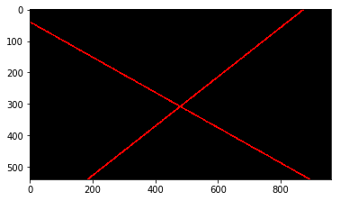

# **Finding Lane Lines on the Road** 

**Finding Lane Lines on the Road**

The goals / steps of this project are the following:
* Make a pipeline that finds lane lines on the road
* Reflect on your work in a written report

[//]: # (Image References)

[image1]: ./examples/grayscale.jpg "Grayscale"

---

### Reflection

### 1. Description of image processing pipeline. As part of the description, explain how you modified the draw_lines() function.

#### 1.1. Image Pipeline Overview

My pipeline consisted of 7 steps:

 1. First, I converted the images to gray-scale.
 2. Then used a Gaussian filter to filter the image.
 3. Used Canny edge detection.
 4. Created a region of interest using a mask to restrict edges of interest.
 5. Used the Hough Transform to find lines from the Canny Edges.
 6. Generated right and left lines by modifying the draw_lines() function.
 7. Superimpose the left and right lines on the original image.

##### 1.1.1. Convert Images to Gray-scale
Lane lines are not always the same color, and even lines of the same color under different lighting conditions (day, night, etc) may fail to be detected by our simple color selection. Therefore image converted to gray-scale as pre-processing step.

##### 1.1.2. Gaussian Filtering
Gaussian smoothing, before running Canny, which is essentially a way of suppressing noise and spurious gradients by averaging.

##### 1.1.3. Canny Edge Detection
Applying the Canny algorithm to the gray-scale image produces another image illustrating edges in the image. Strong edge (strong gradient) pixels above the `high_threshold` are retained, and reject pixels below the `low_threshold`; pixels with values between the `low_threshold` and `high_threshold`will be included as long as they are connected to strong edges. The output `edges` is a binary image with white pixels tracing out the detected edges and black everywhere else.

##### 1.1.4. Region of Interest
Assuming that the front facing camera that took the image is mounted in a fixed position on the car, such that the lane lines will always appear in the same general region of the image a polygon masking region can be applied to the binary image to exclude edges not relevant for lane line detection.

##### 1.1.6. Hough Transform
_Hough transform_ is a feature extraction technique used in image analysis. The purpose of the technique is to find imperfect instances of objects within a certain class of shapes by a voting procedure. Here it is used to detect lines in the form of lane markings. Full breakdown of draw_lines() found in [Drawlines Functionality](#draw_lines) section.

##### 1.1.6. Combination
Finally the original image is combines with the lines generated from the image processing pipeline to output:

#### 1.2. Drawlines Functionality Deep Dive

The enhanced draw_lines() function consisted of 5 steps (found in 
[tutorial](http://ottonello.gitlab.io/selfdriving/nanodegree/python/line%20detection/2016/12/18/extrapolating_lines.html)):

 1. Separate edges according to left and right lane classifications into separate co-ordinates lists.
	 a. left lane angle > 55 deg && < 85 deg
	 b. right lane angle > 95 deg && < 135 deg
 2. Use regression via fitline() method from OpenCV to fit a line.
 3. Calculate slope and intercept parameters from fitline output.
 4. Using y dimensions of the image the corresponding x co-ords can be calculated from slope and intercept parameters for each line.
 5. Lines are generated and then masked.

### 2. Identify potential shortcomings with your current pipeline

 - Currently only fits straight lines to lane markings.
 - Region masking uses simple quadrilateral.
 - The front facing camera that took the image is assumed to be mounted in a fixed position on the car, such that the lane lines will always appear in the same general region of the image.

### 3. Suggest possible improvements to your pipeline

 - Region masking could use any polygon so more spurious edges could be removed before fitting a line.
 - Hough Transform parameters could be modified to detect different kind of lines (i.e., long lines, short lines, bendy lines, dashed lines, etc.).

